```mermaid
graph TD
    %% Fato Central
    FV[fVendas]:::fact

    %% Dimensões Principais
    DC[dClientes]:::dim --> FV
    DV[dVendedores]:::dim --> FV
    DP[dProdutos]:::dim --> FV
    DT[dCalendario]:::dim --> FV
    DS[dStatus_pedido]:::dim --> FV
    DTP[dTipo_pedido]:::dim --> FV
    DTE[dTipo_envio]:::dim --> FV
    DMP[dMetodo_pagamento]:::dim --> FV

    %% Estilização
    classDef fact fill:#e1f5fe,stroke:#01579b,stroke-width:2px;
    classDef dim fill:#f3e5f5,stroke:#4a148c,stroke-width:2px;
```

# 📊 Documentação do Modelo de Dados Analítico

## 🎯 Apresentação

Bem-vindo à documentação oficial do modelo de dados analítico. Este repositório centraliza as definições das tabelas de **Dimensão**, **Fato** e **Agregações** utilizadas para análise de performance comercial, comportamento do cliente e eficiência logística.

## 🏗️ Visão Geral da Arquitetura

O modelo segue uma arquitetura **Star Schema** (Esquema Estrela), otimizado para relatórios de Business Intelligence (BI). O núcleo analítico é focado nas transações de vendas, cercado por dimensões descritivas que fornecem contexto (Quem vendeu? Quem comprou? Quando? O quê?).

## 📐 Diagrama Conceitual Simplificado

## 🗂️ Catálogo de Tabelas

### 📈 Tabelas Fato (Facts)

| Tabela | Descrição | Métricas Principais |
|---|---|---|
| **`fVendas`** | Tabela central de transações comerciais | `amount_charged`, `order_total`, `quantity` |
| **`fCarrinhos_abandonados`** | Intenções de compra não finalizadas | `quantity`, `unit_price`, `session_id` |
| **`fLogins`** | Eventos de autenticação na plataforma | `login_date`, `login_type`, `account_type` |
| **`fDatalayer_session_summary`** | Resumo de sessões de navegação | `session_time_in_seconds`, `user_type` |
| **`fDatalayer_product_pageviews`** | Visualizações de produtos | `distinct_count_session`, `sku_id` |

### 🏷️ Tabelas Dimensão (Dimensions)

#### 👥 Dimensões de Pessoas e Entidades

| Tabela | Descrição | Campos Chave |
|---|---|---|
| **`dClientes`** | Visão 360º do cliente | `credit_limit`, `client_segment`, `region` |
| **`dVendedores`** | Perfil da força de vendas | `salesperson_account_id`, `line`, `division` |
| **`dAssociados`** | Parceiros comerciais | `partner_type`, `estados_b2b`, `frota_propria` |
| **`dCarteirizacao`** | Relacionamento comercial | `id_account_customer`, `id_account_seller` |

#### 📦 Dimensões de Produtos

| Tabela | Descrição | Campos Chave |
|---|---|---|
| **`dProdutos`** | Catálogo mestre de SKUs | `sku_id`, `manufacturer`, `category_level_1` |
| **`dOfertas`** | Disponibilidade e preços | `unit_price`, `quantity_available`, `by_request` |

#### 📅 Dimensões de Tempo

| Tabela | Descrição | Campos Chave |
|---|---|---|
| **`dCalendario`** | Dimensão temporal mestre | `datekey`, `DiaUtil`, `Feriado` |
| **`dFeriados`** | Calendário de datas especiais | `Data`, `Feriado`, `Dia_Semana` |

#### ⚙️ Dimensões Operacionais

| Tabela | Descrição | Campos Chave |
|---|---|---|
| **`dStatus_pedido`** | Pipeline de vendas | `order_status_id`, `order_status` |
| **`dTipo_envio`** | Modalidades logísticas | `shipping_type_id`, `shipping_type` |
| **`dTipo_pedido`** | Natureza da operação | `order_type_id`, `order_type` |
| **`dMetodo_pagamento`** | Formas de pagamento | `payment_method_id`, `payment_method` |
| **`dCupons`** | Promoções e campanhas | `coupon_id`, `code`, `campaign` |
| **`dDispositivos`** | Plataformas de acesso | `device_id`, `device` |

### 📊 Tabelas Agregadas

| Tabela | Descrição | Uso Principal |
|---|---|---|
| **`agg_last_login`** | Último acesso do usuário | Cálculo de recência e churn |
| **`agg_last_purchase`** | Última compra por cliente | Análises RFM |

## 🚀 Capacidades Analíticas

### 📈 Performance Comercial
- **Faturamento por período:** `fVendas` + `dCalendario` + `dVendedores`
- **Taxa de conversão:** `fVendas` vs `fCarrinhos_abandonados`
- **Desempenho por canal:** `fVendas` + `dClientes`.`account_origin`

### 👥 Análise de Clientes (CRM)
- **Segmentação RFM:** `agg_last_purchase` + `fVendas` + `dClientes`
- **Risco de crédito:** `dClientes`.`credit_limit` vs `credit_balance`
- **Base ativa/inativa:** `agg_last_purchase`.`days_since_last_purchase`

### 🚚 Logística e Operações
- **Custo de frete:** `fVendas`.`median_charged_shipping` + `dTipo_envio`
- **Eficiência por parceiro:** `fVendas` + `dAssociados`
- **Performance por região:** `fVendas` + `dClientes`.`region`/`UF`

## 🛠️ Estrutura Técnica

### 🔑 Chaves de Relacionamento

| Chave | Formato | Descrição |
|---|---|---|
| **`datekey`** | AAAAMMDD | Relacionamento temporal |
| **`account_id`** | INTEGER | Identificador único de contas |
| **`client_id`** | INTEGER | Chave de integração com ERP |
| **`sku_id`** | INTEGER | Identificador único de produtos |

### 📋 Tipos de Dados

| Tipo | Uso | Exemplo |
|---|---|---|
| **`DECIMAL(18,2)`** | Valores financeiros | `amount_charged`, `order_total` |
| **`DATE`** | Datas completas | `account_create_date` |
| **`INTEGER`** | Identificadores e contagens | `account_id`, `quantity` |
| **`VARCHAR(50-255)`** | Textos e descrições | `name`, `description` |
| **`BOOLEAN`** | Flags e status | `client_status`, `wpp_opt_in` |

## 📊 Status do Modelo

**Versão:** 1.0  
**Última Atualização:** Dezembro 2024  
**Ambientes:** Produção, Homologação, Desenvolvimento  

---

